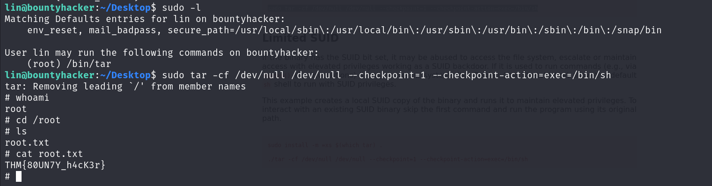

# Welcome to my "Bounty Hacker" CTF walkthorugh!
You can find this CTF on https://tryhackme.com/

## Deploy the machine
Deploy the machin and get a Target IP Address. I used a Kali virtual machine so I connected using OpenVPN.

## Find open ports on the machine

I started by performing a port scan on the host using Nmap. The -sC and -sV flags ensure that basic vulnerability detection scripts are run against the target and that the scan attempts to identify the versions of services running on open ports.
  

 

We found 3 open ports: 21 (ftp), 22 (ssh) and port 80 (http)
We see that anonymous access is available on the FTP service.
Let’s try logging in on the ftp service:

 

 
We discovered task.txt file on it and a locks.txt file
  

## Who wrote the task list?

We can see that lin has written the task file.
  

  

## What service can you bruteforce with the text file found?
We can bruteforce to the ssh server since we have a user and a possible passwords list.
Let's use hydra:

## User Flag

We've found a password! Now, we can connect via ssh and get yhe user flag:

## Root Flag -Privilege Escalation

I used the command sudo -l to identify which files run as root.
We’ve discovered that the /bin/tar command can be executed with root privileges. This is a potential privilege escalation vector we can exploit!
For more details on this vulnerability, I found useful information at the following source: https://gtfobins.github.io/gtfobins/tar/
 

 

 

## Thank you for taking the time to read my walkthrough!

