# Welcome to my "Cyborg" CTF walkthorugh!
You can find this CTF on https://tryhackme.com/

## Task 1: Deploy the machine
Deploy the machin and get a Target IP Address. I used a Kali virtual machine so I connected using OpenVPN.

## Task 2: Compromise the System
I started by performing a port scan on the host using Nmap. The -sC and -sV flags ensure that basic vulnerability detection scripts are run against the target and that the scan attempts to identify the versions of services running on open ports.
  

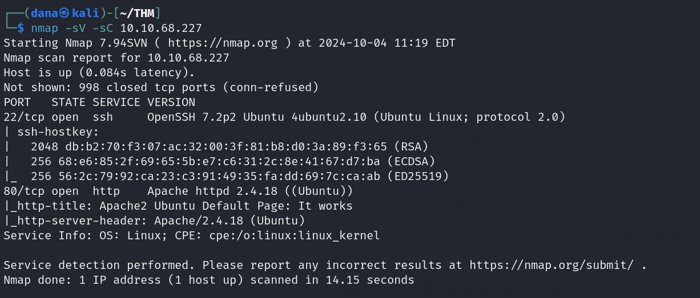
 

We can answer questions 1-3 with the results of our nmap scan.

Let’s check out the web server to see what’s there.

 

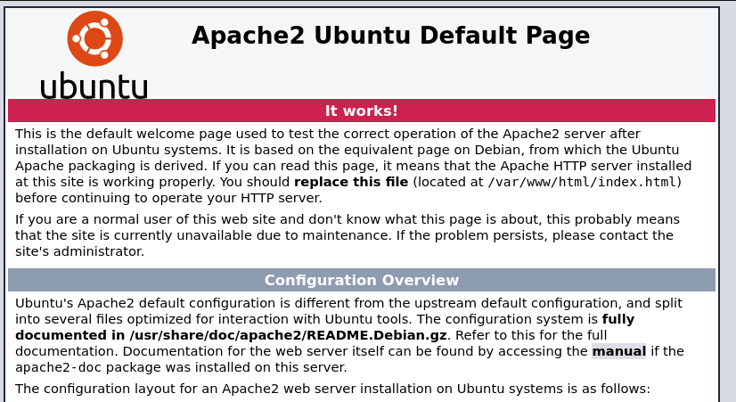
 

Next we are going to use Gobuster :
 

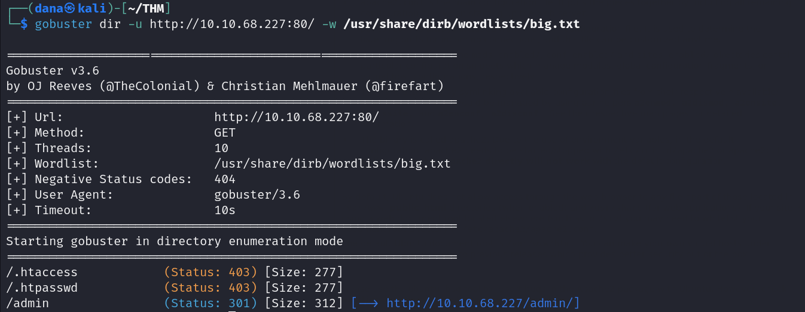
 

The two notable directories appear to be /admin and /etc. Let’s begin with /etc, where we found a directory named "squid."
Inside, we discovered a passwd file and a configuration file. The config file includes some authentication rules, while the passwd file contains a username and a password hash.

 

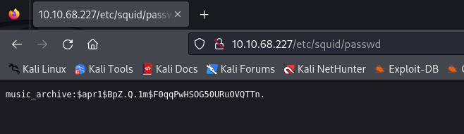
 

I craked the hash using john following the above command:
 

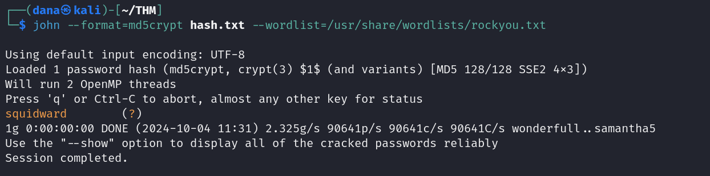
 

## User Flag

We've found a password! Now, heading back to the admin section, there's an option to download an archive file by clicking one of the links in the header. 
You can download the archive.tar file by running: "tar -xvf archive.tar"
 

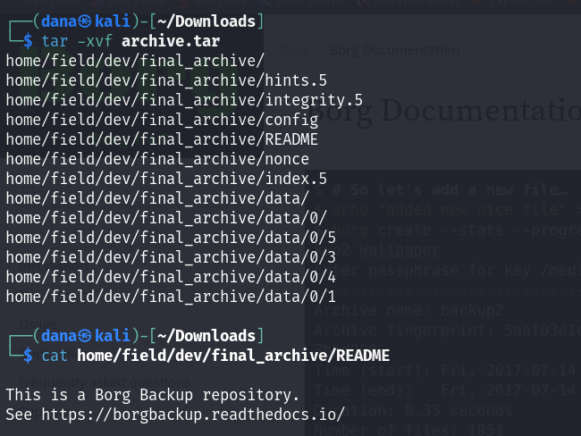
 

We've just discovered that these files are part of a backup created using Borg. we can install Borg and extract the files.
We can use the following command to do this:
 

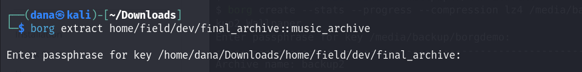
 

We will be prompted to enter the password we cracked earlier. Afterward, if we check the home directory, we’ll see that a new directory has been created.
This new directory holds Alex's home directory. The Desktop folder contains a note congratulating us on our progress, while the Documents folder contains login credentials.

 

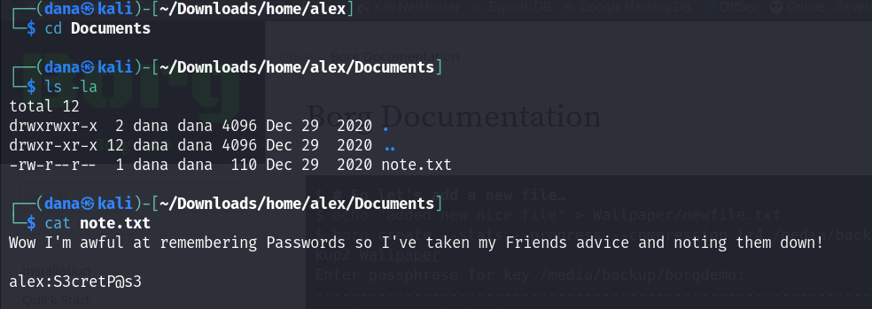
 

Let’s use these credentials to access the target via SSH.

 

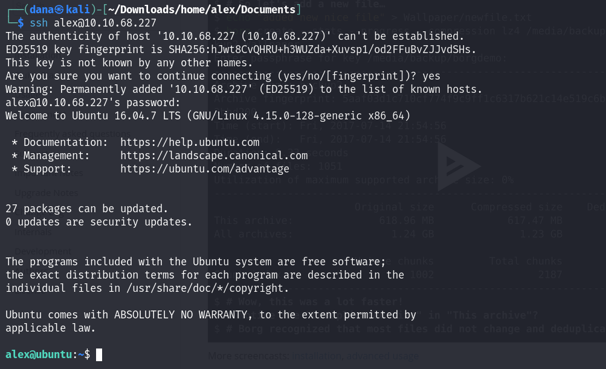
 

 After logging in, we can list the files in this user’s directory and collect the user flag.
 
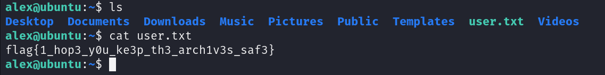
 

## Root Flag -Privilege Escalation

I used the command sudo -l to identify which files run as root. The file is owned by Alex, allowing us to freely edit its contents to gain root access.
Once you are root tou can access the root.txt.
Run the following commands to become the root user:

 

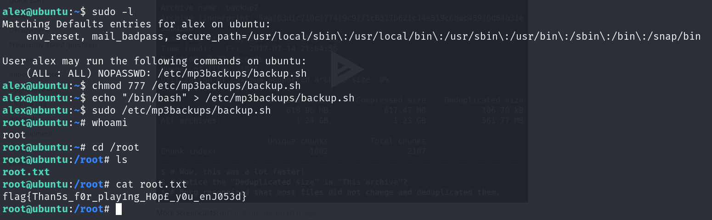
 

## Thank you for taking the time to read my walkthrough!

